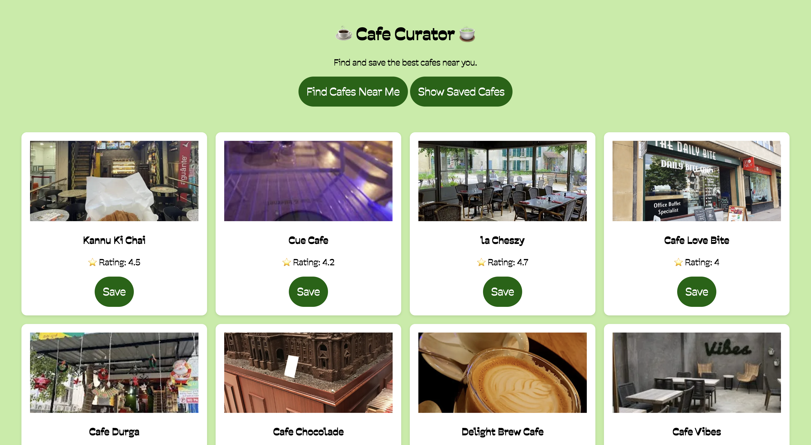

# Cafe Finder

A web application to discover nearby cafes, save your favorites, and explore locations without relying on Google Maps API.

# Screenshots

## 🚀 Features
- Discover nearby cafes based on your location.
- View cafe details including name, address, and images.
- Save favorite cafes locally using localStorage.
- Swipe through cafes with smooth interactions.
- Works offline for previously viewed cafes.

# Tech Stack
- Frontend: HTML, CSS, JavaScript, React 18
- Libraries & Tools: React-Bootstrap 2, Hammer.js
- Backend: None (JSON data used for cafes)
- Storage: localStorage for favorites

# Installation
- Clone the repository
- git clone https://github.com/yourusername/cafe-finder.git
- cd cafe-finder
- npm install
- npm start
- Open http://localhost:3000 in your browser.